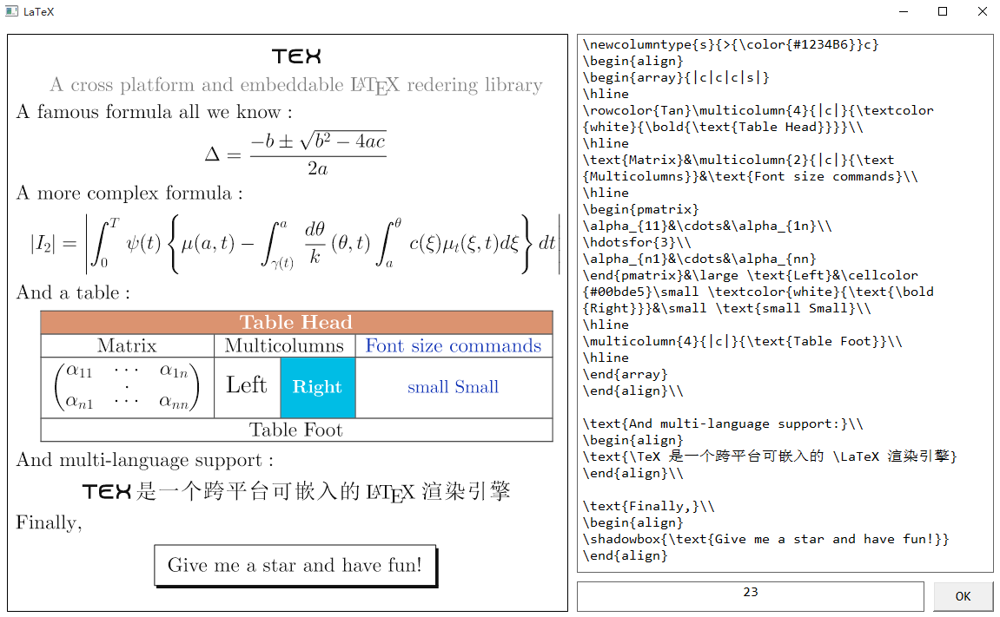

# cLaTeXMath

`cLaTeXMath` is a cross platform LaTeX rendering library that can be embedded into your applications (Android, iOS, Windows, Mac OS and so on). Here is an example to show how it works.



# How to use

First make sure your compiler has support for `C++ 11`, and than import the code into your project and compile. `cLaTeXMath` requires [tinyxml2](https://github.com/leethomason/tinyxml2) (it has been included in the project, you can find it at folder `xml`) to parse resources, and no other external dependencies are required. For windows, after compile and link you can just run the generated executable file to check out how it works.

`cLaTeXMath` sealed all implementation details of LaTeX, its syntax, its macros, its rendering rules and so on. The following 3 classes are defined in file `port.h` that you must implement on specific platform.

- *Font*
  This class represents font informations, the project use it to create font.

- *Graphics2D*
  This class represetns 2D-graphics context, the project use it to draw all LaTeX elements.

- *TextLayout*
  The project use this class to layout text with no newline.

The global variable `RES_BASE` specifies the **root directory of the resources** that is decalared in file `common.h` and defined in file `latex.cpp`, the project use it to find the predefined resources.

The windows version and the iOS version has been implemented already, please check out file `port/port_win32.cpp` and `port/port_iOS.mm`, and the Android version is on the way.

## Rendering your own LaTeX

To redering your own LaTeX, there are some classes you should notice

- *LaTeX*
  This class implements basic operations include **load resources to memory**, **release resources from memory** and **parse LaTeX formatted text**.

- *TeXRender*
  A abstract graphical representation of a formula, that can be painted on 2D-graphics context.

- *TeXRenderBuilder*
  A class to hold all attributes to build a TeXRender, include width, font size, foreground and so on.

For more details, please check out  `latex.h` and `render.h`.

Before proceed, you must specify the **root directory of the resources** via `RES_BASE` (the default value is `res`), and call `LaTeX::init()` to load required resources.

And there are two main way to redering your own LaTeX, following are 2 examples to show how to do it.

- Singleton pattern

``` c++
#include "latex.h"

using namespace tex;
using namespace tex::core;
using namespace tex::port;

void drawFormula() {

	// Load required resources
	LaTeX::init();

    // The LaTeX formatted string to parse
	wstring ltx = L"\\text{What a beautiful day}";
	TeXRender* render = LaTeX::parse(ltx,
    	// Logical width of the 2D-graphics context
        720,
        // Font size
        23,
        // Line space
        10,
        // Foreground color
        0xff101010);

	Graphics2D g2d();
    // Draw the generated formula on 2D-graphics context
    render->draw(g2d,
    	// Left position
    	10,
        // Top position
    	10);

	// Remember to delete the render
	delete render;
}
```

- Builder pattern

``` c++
#include "latex.h"

using namespace tex;
using namespace tex::core;
using namespace tex::port;

void drawFormula() {

	// Load required resources
	LaTeX::init();

	TeXFormula formula;
    TeXRenderBuilder builder;

    // The LaTeX formatted string to parse
	wstring ltx = L"\\text{What a beautiful day}";
    formula.setLaTeX(ltx);

	TeXRender* render = builder
    	// With SYTLE_DISPLAY, for more details, check out enum TeXConstants
    	.setStyle(STYLE_DISPLAY)
        // Font size
    	.setSize(23)
        // Logical width, width unit and alignment of the 2D-graphics context
        .setWidth(UNIT_PIXEL, 720, ALIGN_LEFT)
        // If the width specified before is the max width
        .setIsMaxWidth(false)
        // Line space
        .setInterlineSpacing(UNIT_PIXEL, 10)
        .setForeground(0xff101010)
        // Build with specified attributes
        .build(formula);

	Graphics2D g2d();
    // Draw the generated formula on 2D-graphics context
    render->draw(g2d,
    	// Left position
    	10,
        // Top position
    	10);

	// Remember to delete the render
	delete render;
}
```

It should be noted that the **constructor** of `Graphics2D` may has different versions on different platforms because it has its own definition on specific platform.

## Debugging and memory leak checking

The project defines some pre-compiled flags to help us to debug. You should close these flags before release the project because these flags will slow down the program.

The program will output some infomations (resources, symbols, predefined macros...) if the flag `__DEBUG` is open. The macro `__DBG` and `__log` help us to print infomations to the console. Following code fragment shows the definitions of these flags.

```c++
#define __DEBUG

#define __DBG(format, ...) \
{\
	printf("FILE: %s, LINE: %d, FUNCTION: %s, MSG: " format, __FILE__, __LINE__, __FUNCTION__, ##__VA_ARGS__);\
}

// ...

#ifdef __DEBUG
#include <iostream>
#define __log std::cout
#endif
```

It should be noted that the macro `__log` is defined under `__DEBUG`, you should use it under `__DEBUG` otherwise the compiler will told you the flag `__log` can not be found. Here is an example to show how to use it.

```c++
#ifdef __DEBUG
__log >> "some informations";
#endif
```

## Resources

## Symbols and macros

# Documentation

Please see [here](https://nanomichael.github.io/cLaTeXMath/).

# License
