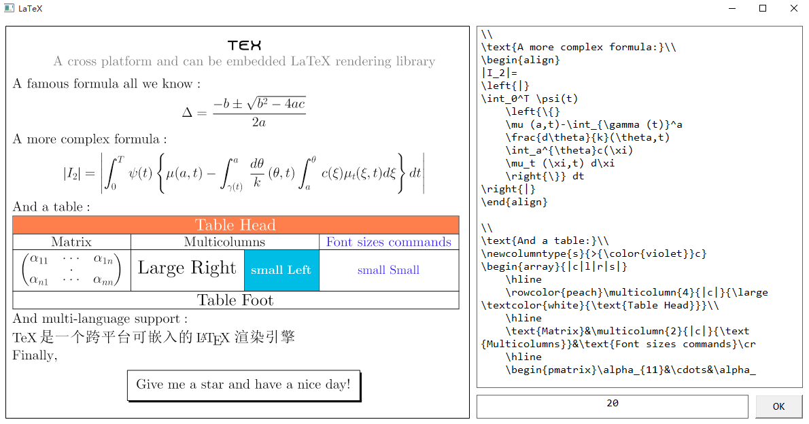

# C_TeX

`C_Tex` is a cross platform LaTeX rendering library that can be embedded into your applications (Android, iOS, Windows, Mac OS and so on). Here is an example to show how it works.

# Documentation

Coming soon...
