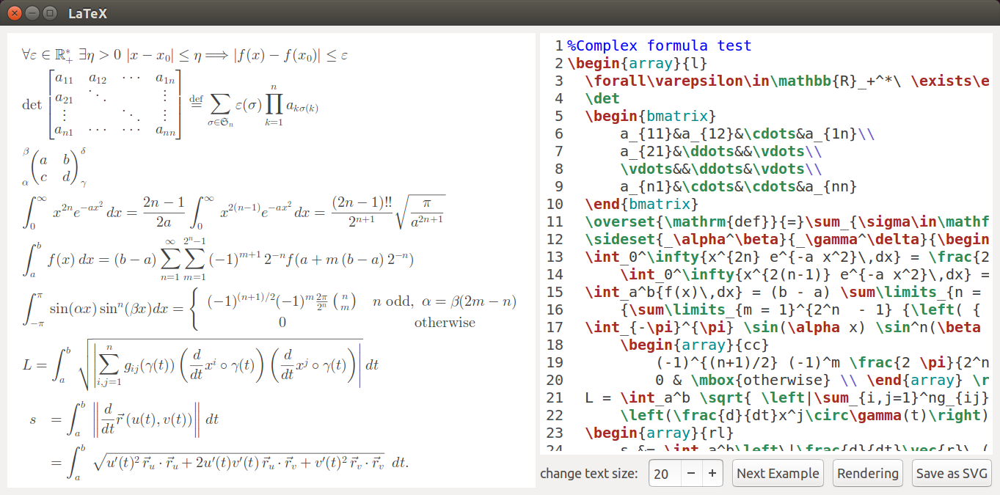

# 

It is a dynamic, cross-platform, and embeddable LaTeX rendering library. Its main purpose is to display mathematical formulas written in LaTeX. It can be embedded in applications on various platforms (Android, iOS, Windows, Linux GTK, Qt...). The following pictures demonstrate the application run in Ubuntu (using GTK) and Windows.




[Here](readme/samples.md) contains more demos you may want to take a look.

# Build demo

First make sure you have a C++ compiler that supports `C++ 17` standard. It uses CMake to build the demo, make sure you have it installed. Currently support Windows and Linux on PC, the version on Mac OS is in the plan, and you can find the Android version in [here](https://github.com/NanoMichael/AndroidLaTeXMath).

- `CygWin` or `MinGW` is recommended to be installed on Windows, and `Gdiplus` is required.
- `GTKMM` and `GSVMM` must be installed on Linux for a GTK build.
- Qt development packages must be installed for a Qt installation.

After all the dependencies have been satisfied, run the following commands to build:

```sh
cd your/project/dir
mkdir build
cd build
cmake ..
make -j32
```

After all the works have done, run the executable file `LaTeX` in the directory `build` to check the demo.

If you wish to build in Qt mode on your plaform add `-DQT=ON` to the cmake command above.

## Headless mode

It supports to run with headless mode (no GUI) on Linux OS, check the scripts below to learn how to do this.

Batch mode:

```sh
./LaTeX -headless \
    -samples=res/SAMPLES.tex \
    -outputdir=samples \
    -prefix=sample_ \
    # common options
    -textsize=14 \
    -foreground=black \
    -background=white \
    -padding=0 \
    -maxwidth=720
```

Single mode:

```sh
./LaTeX -headless \
    "-input=\sqrt[3]{(x-y)^3}=x-y" \
    -output=an_example.svg
    # other options...
```

**COMMON OPTIONS**

- `-h`: show usages and exit

- `-headless`: tells the application to run with the headless mode, that converts the input LaTeX codes into SVG images

- `-textsize`: config the font size (in point) to display formulas, the default is 20

- `-foreground`: config the foreground color to display formulas; the value can be a color name or in the form of #AARRGGBB; default is black

- `-background`: config the background color to display formulas; the value can be a color name or in the form of #AARRGGBB; default is transparent

- `-padding`: config spaces to add to the SVG images, the default is 10

- `-maxwidth`: config the max width of the graphics context, the default is 720 pixels; this option has weak limits on the SVG images, thus the width of the SVG image may be wider than the value defined by this option

**BATCH MODE OPTIONS**

The program will save the SVG images produced by the LaTeX codes that parsed from the given file (specified by the option '-samples') into the directory specified by the option '-outputdir'.

- `-outputdir`: indicates the directory to save the SVG images

- `-samples`: specifies the file that contains several LaTeX codes split by a line that consists of the character '%' only, the default is './res/SAMPLES.tex'; check [this file](res/SAMPLES.tex) to get more details

- `-prefix`: specifies the prefix of the filename of the SVG images, the default is ''; for example if 2 pieces of code have given with the option '-prefix=a_', the filename of the SVG images will be 'a_0.svg' and 'a_1.svg'

**SINGLE MODE OPTIONS**

- `-input`: the source code that is written in LaTeX

- `-output`: indicates where to save the produced SVG image, only works if the option '-input' has given

> **NOTICE**
>
> If both '-outputdir' and '-input' are specified, the '-input' option wins. Run the command `./LaTeX -h` to get helps.

Please read [this section](#Display-mathmatical-formulas) to learn more.

## Compile-time options

The program can be built just fine using the default compilation options. However, if required, the options documented below can be used to omit some features (that can reduce the library size) and to check memory only.

### HAVE_LOG

If HAVE_LOG is defined, the program will output some logs (e.g.: the symbols parse result, generated box tree and so on) during runtime to help us to find out if there're issues or bugs, the default is **ON**. The option will be disabled when building with release mode, you can set it to **OFF** manually to make double insurance. For example, when parsing the following LaTeX code with the option is defined:

```tex
\sqrt[3]{(x-y)^3}=x-y
```


will produce the following box tree:

```
0    HorizontalBox
1    ├── HorizontalBox
2    │   ├── StrutBox
2    │   ├── CharBox
2    │   ├── StrutBox
2    │   └── HorizontalBox
3    │       ├── CharBox
3    │       └── OverBar
4    │           ├── StrutBox
4    │           ├── HorizontalRule
4    │           ├── StrutBox
4    │           └── HorizontalBox
5    │               ├── HorizontalBox
6    │               │   ├── CharBox
6    │               │   ├── GlueBox
6    │               │   ├── CharBox
6    │               │   ├── GlueBox
6    │               │   ├── CharBox
6    │               │   ├── GlueBox
6    │               │   ├── CharBox
6    │               │   ├── GlueBox
6    │               │   └── HorizontalBox
7    │               │       ├── CharBox
7    │               │       ├── HorizontalBox
8    │               │       │   ├── CharBox
8    │               │       │   └── StrutBox
7    │               │       └── StrutBox
5    │               └── StrutBox
1    ├── GlueBox
1    ├── CharBox
1    ├── GlueBox
1    ├── CharBox
1    ├── GlueBox
1    ├── CharBox
1    ├── GlueBox
1    └── CharBox
```

The number represents the depth of the tree node.

### GRAPHICS_DEBUG

If this macro is defined, then the custom command `\debug` and `\undebug` will be compiled, the default is **ON**. The program will draw some assisted information to help us to check if there're issues when draw formulas after run `\debug`, and `\undebug` will close this feature. For example, parse the LaTeX code below:

```tex
\debug
\newcolumntype{s}{>{\color{#1234B6}}c}
\begin{array}{|c|c|c|s|}
  \hline
  \rowcolor{Tan}\multicolumn{4}{|c|}{\textcolor{white}{\bold{\text{Table Head}}}}\\
  \hline
  \text{Matrix}&\multicolumn{2}{|c|}{\text{Multicolumns}}&\text{Font size commands}\\
  \hline
  \begin{pmatrix}
      \alpha_{11}&\cdots&\alpha_{1n}\\
      \hdotsfor{3}\\
      \alpha_{n1}&\cdots&\alpha_{nn}
  \end{pmatrix}
  &\large \text{Left}&\cellcolor{#00bde5}\small \textcolor{white}{\text{\bold{Right}}}
  &\small \text{small Small}\\
  \hline
  \multicolumn{4}{|c|}{\text{Table Foot}}\\
  \hline
\end{array}
```

will produce:


The red blocks represent the depth of the boxes, and these rectangles represent the boxes' bounds.

### MEM_CHECK

Basically, the program implemented an empty graphics interface (check [this file](src/samples/mem_check_main.cpp)), all the other implementations will be ignored if the `MEM_CHECK` option is defined, the default is **OFF**. It is useful when using `valgrind` to detect memory leaks and memory misuse, make sure you have compiled it with the option `-DCMAKE_BUILD_TYPE=Debug` before using `valgrind`. The following script shows how to do memory check using `valgrind`.

```sh
cmake 
    -DCMAKE_BUILD_TYPE=Debug \
    -DGRAPHICS_DEBUG=ON \
    -DMEM_CHECK=ON \
    -DHAVE_LOG=OFF ..
make -j32
valgrind --leak-check=full -v ./LaTeX
```

will produce:

```
==26443== HEAP SUMMARY:
==26443==     in use at exit: 72,704 bytes in 1 blocks
==26443==   total heap usage: 84,520 allocs, 84,519 frees, 12,515,092 bytes allocated
==26443== 
==26443== Searching for pointers to 1 not-freed blocks
==26443== Checked 111,952 bytes
==26443== 
==26443== LEAK SUMMARY:
==26443==    definitely lost: 0 bytes in 0 blocks
==26443==    indirectly lost: 0 bytes in 0 blocks
==26443==      possibly lost: 0 bytes in 0 blocks
==26443==    still reachable: 72,704 bytes in 1 blocks
==26443==         suppressed: 0 bytes in 0 blocks
==26443== Reachable blocks (those to which a pointer was found) are not shown.
==26443== To see them, rerun with: --leak-check=full --show-leak-kinds=all
==26443== 
==26443== ERROR SUMMARY: 0 errors from 0 contexts (suppressed: 0 from 0)
```

# How to use

This section shows how to use this library to display mathematical formulas.

First, load the required resources at the very beginning:

```c++
#include "latex.h"

using namespace tex;

/**
 * Initialize the program with the default parameter (directory
 * path of the resources) value "res" to load required resources,
 * that may take a long time, you may call it from a background
 * thread.
 *
 * Also, you can use the code below to specifies your custom
 * resources directory:
 * 
 *      LaTex::init("your/resources/root/directory");
 */
LaTeX::init();

// After initialization, you could display your formulas now
```

You could set the point size (pixels per point) use the code below:

```c++
/** 
 * Set the point size; the default value is 1 that means
 * use 1 pixel to represent 1 point.
 */
TeXFormula::PIXELS_PER_POINT = 2;
```

Also, you could set the DPI (dots per inch) use the code below:

```c++
/**
 * For example, set the DPI-target to 74, the point size
 * will be 74/72
 */
TeXFormula::setDPITarget(74);
```

Write the code below to release resources before application exit, it is not necessary but is a good habit.

```c++
// ... some other code ...
// before application exit

LaTeX::release();
```

## Display mathematical formulas

General mode:

```c++
// ... initialization ...

/**
 * The LaTeX code to parse.
 * 
 * The program uses wide string to represent UTF characters, you
 * could use the code below to convert a string with UTF-8 encoding
 * to a wide string:
 * 
 *      wstring wstr = utf82wide("A string with UTF-8 encoding.");
 */
wstring code = L"\\int_{now}^{+\\infty} \\text{Keep trying}";
// Convert the code to a paintable object (TeXRender)
auto r = LaTeX::parse(
    code,   // LaTeX code to parse
    720,    // logical width of the graphics context (in pixel)
    20,     // font size (in point)
    10,     // space between 2 lines (in pixel)
    BLACK   // foreground color
);
```

Builder mode:

```c++
wstring code = L"\\int_{now}^{+\\infty} \\text{Keep trying}";
TeXFormula formula;
TeXRenderBuilder builder;
formula.setLaTeX(code);

auto r = builder
    // environment style, see TeXConstants (defined in common.h) to
    // get more details
    .setStyle(STYLE_DISPLAY)
    // text size (in point)
    .setSize(20)
    // the logical width and the alignment of the graphics context
    .setWidth(UNIT_PIXEL, 720, ALIGN_LEFT)
    // set if the logical width of the graphics context specified
    // above is the max width to display the formula, the formula
    // will be centered if set to true; you must call this method
    // after 'setWidth' has called, otherwise an ex_invalid_state 
    // exception will be thrown
    .setIsMaxWidth(false)
    // space between 2 lines
    .setLineSpace(UNIT_PIXEL, 10)
    .setForground(tex::BLACK)
    // convert the formula to a paintable object (TeXRender)
    .build(formula);
```

> **NOTICE**
>
> A style and text size are required to build a TeXRender, in another word, you must call method `setStyle` and `setSize` before method `build` has been called, otherwise an `ex_invalid_state` exception will be thrown. If the logical width has not set, the generated TeXRender may be wide enough to overflow into the graphics context.

Now you can draw the generated `TeXRender` (take `Graphics2D_cairo` that uses `cairomm` to implement the graphics (2D) context that run in Linux as an example):

```c++
// cairomm implementation
Graphics2D_cairo g2;
// draw the formula on the coordinate (10, 10) of the graphics context
r->draw(10, 10);
// IMPORTANT: remember to delete the generated TeXRender after there
// is no use on it.
delete r;
```

The code above will produce:


## Implement the graphical interfaces

Basically, you need to implement all the interfaces declared in [this file](src/graphic/graphic.h). There're 4 implementations list below, check it out before the start.

- `graphic_cairo`: that uses `cairomm` and `gtkmm` to implement these interfaces that run in Linux, declared in [here](src/platform/cairo/graphic_cairo.h), and implemented [here](src/platform/cairo/graphic_cairo.cpp).

- `graphic_win32`: is a Windows implementation that uses `gdiplus` to implement these interfaces, please check [here](src/platform/gdi_win/graphic_win32.h) and [here](src/platform/gdi_win/graphic_win32.cpp).

- And implementations on Android OS can be found at [here](https://github.com/NanoMichael/AndroidLaTeXMath).

- And the empty implementations to perform memory check are defined in [here](src/samples/mem_check_main.cpp).

The following sections illustrate these interfaces.

### tex::Font

This interface represents a font (typeface). The program uses it to draw characters and layout boxes. The code below shows how to implement this interface with the name `Font_impl`.

```c++
#include "graphic/graphic.h"

namespace tex {

class Font_impl : public tex::Font {
public:

    Font_impl(const string& file, float size) {
        // load platform-specific font from given file and size
    }

    Font_impl(const string& name, int style, float size) {
        // create platform-specific font with given name, style
        // and size
    }

    // ... implementations of the other methods ...
};

/**
 * IMPORTANT: do not forget to implement the 2 static methods below,
 * it is the factory methods to create a new font.
 */

Font* Font::create(const string& file, float size) {
    return new Font_impl(file, size);
}

sptr<Font> Font::_create(const string& name, int style, float size) {
    return sptr<Font>(new Font_impl(name, style, size));
}

} // namespace tex
```

### tex::TextLayout

An alphabet contains several Unicode-blocks on a **Basic Multilingual Plane** (BMP), check [here](https://en.wikipedia.org/wiki/Plane_(Unicode)) for more information.

For these characters in unregistered alphabets, the library uses `tex::TextLayout` to layout it. For example, parse the following LaTeX code:

```tex
\int_{now}^{\infty} \text{努力}
```

The character "努" and "力" are under the Unicode-block [CJK Unified Ideographs](https://en.wikipedia.org/wiki/CJK_Unified_Ideographs_(Unicode_block)) belongs to the alphabet CJK that has not registered with the program, it will use the implementation of the class `tex::TextLayout` to layout the text "努力" and calculate the layout bounds. The `tex::TextLayout_cairo` implementation (declared in [here](src/platform/cairo/graphic_cairo.h)) demonstrates how to do this.

The LaTeX code above will produce:


The predefined Unicode-blocks are list below, check [this file](src/fonts/alphabet.cpp) for more details.

```
name               code range
-----------------  ---------------
BASIC_LATIN        0x0020 ~ 0x007F
LATIN1_SUPPLEMENT  0x0080 ~ 0x00FF
CYRILLIC           0x0400 ~ 0x04FF
GREEK              0x0370 ~ 0x03FF
GREEK_EXTENDED     0x1f00 ~ 0x1FFF
UNKNOWN            0xFFFF ~ 0xFFFF
```

Write the code below to register a new alphabet with the program:

```c++
class NewAlphabetRegistration : public AlphabetRegistration {
private:
    vector<UnicodeBlock> _blocks;

public:
    NewAlphabetRegistration(const vector<UnicodeBlock>& blocks)
        :_blocks(blocks) {}

    const vector<UnicodeBlock>& getUnicodeBlock() const override {
        return _blocks;
    }

    const string getPackage() const override {
        // the root directory path of the font-mapping and
        // symbols-mapping for this alphabet
    }

    const string getTeXFontFile() const override {
        // language settings (a xml file) for this alphabet
    }
};

// ... some other code ...

// Define a new Unicode-block
auto newBlock = UnicodeBlock::define(
    newAlphabetCodePointStart, 
    newAlphabetCodePointEnd);

// Register the new alphabet
DefaultTeXFont::registerAlphabet(new NewAlphabetRegistration({newBlock});
```

### tex::Graphics2D

This interface defines a 2D graphics context, all the TeX drawing operations will on it. It declares various basic 2D graphics operations, including affine transformations and meta graphical operations. The class `Graphics2D_cairo` (defined in [this file](src/platform/cairo/graphic_cairo.cpp)) uses `cariomm` to implement this interface, take it a look to learn how to achieve it. It is the most important part of the graphical environment, and also very simple, all you need to do is wrap these functions on a specific platform into the form of this interface declared. [This file](src/graphic/graphic_basic.h) declares some built-in colors and various entity classes to support the graphical environment.

# Custom commands and symbols

## \debug and \undebug

As mentioned [above](#GRAPHICS_DEBUG), the command `\debug` and `\undebug` is used to switch graphical debug mode on/off, please check it out.

## \fatalIfCmdConflict

This command takes a boolean argument to determine whether to raise an error that when defining a new command but it has defined already or redefining a command but it has not defined. The default value is true. The script below shows how to use it.

```tex
\fatalIfCmdConflict{true}
% define a new command with the name R
\newcommand{\R}{\mathbb{R}}
\R
% here will cause the program throws an error
% use \fatalIfCmdConflict{false} to disable it
\newcommand{\R}{\mathcal{R}}
```

## \breakEverywhere

This command takes a boolean argument, the predefined value is false. Its functionality is hard to describe, an example worths thousands of words, the examples below show the difference between when it set to true and false.

```tex
\text{What is real? How do you define ‘real’? If you're talking about what you can feel, what you can smell, what you can taste and see, then ‘real’ is simply electrical signals interpreted by your brain. \bold{\text{― Morpheus The Matrix}}}
```

When with `\breakEverywhere{false}`, the result will be:


And with `\breakEverywhere{true}`, the result will be:


> **NOTICE**
>
> The program has a weak ability to handle line feeds when laying out texts, you should try to avoid using it to lay out large amounts of text, delegate these tasks to the text-layout system, and use this program to display formulas is a good choice.

## \TeX and \AndroidTeX

The logo and the logo of the Android version are produced by the command `\TeX` and `\AndroidTeX`, take a quick look:

```tex
\TeX \\
\AndroidTeX
```


## Custom symbols

There're 4 custom symbols in the script below:

```tex
AB \varparallel CD
AB \nvarparallel CD
AB \varparalleleq CD
\parallelogram ABCD
```

that will produce:


# TODO

- [ ] port Gtk+ 3 to Windows and macOS
- [ ] buitin resources
- [ ] support for webassembly
- [ ] native support for SVG
- [ ] make the use of XML configurable
- [ ] make the built-in resources a loadable/unloadable dynamic plugin
- [ ] eliminate the use of 'dynamic_cast'
- [ ] rewrite the parsing algorithm, make it more efficient
- [ ] support for dynamic parsing
- [ ] implement the `\def` command

# License

Excluding the font resources (under the directory `res/font`) that under different licenses (check out `res/fonts/license`), this project is under the [MIT](https://opensource.org/licenses/MIT) license.

```
 The MIT License (MIT)

 Copyright (c) 2020 Nano Michael

 Permission is hereby granted, free of charge, to any person obtaining a copy
 of this software and associated documentation files (the "Software"), to deal
 in the Software without restriction, including without limitation the rights
 to use, copy, modify, merge, publish, distribute, sublicense, and/or sell
 copies of the Software, and to permit persons to whom the Software is
 furnished to do so, subject to the following conditions:

 The above copyright notice and this permission notice shall be included in all
 copies or substantial portions of the Software.

 THE SOFTWARE IS PROVIDED "AS IS", WITHOUT WARRANTY OF ANY KIND, EXPRESS OR
 IMPLIED, INCLUDING BUT NOT LIMITED TO THE WARRANTIES OF MERCHANTABILITY,
 FITNESS FOR A PARTICULAR PURPOSE AND NONINFRINGEMENT. IN NO EVENT SHALL THE
 AUTHORS OR COPYRIGHT HOLDERS BE LIABLE FOR ANY CLAIM, DAMAGES OR OTHER
 LIABILITY, WHETHER IN AN ACTION OF CONTRACT, TORT OR OTHERWISE, ARISING FROM,
 OUT OF OR IN CONNECTION WITH THE SOFTWARE OR THE USE OR OTHER DEALINGS IN THE
 SOFTWARE.
```
