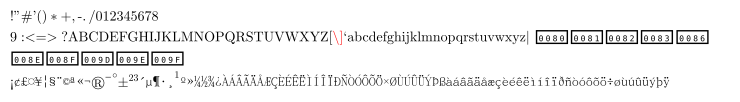
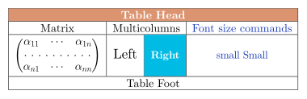
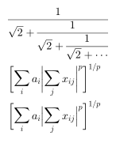

# SAMPLES

```tex
%Side sets test
\sideset{^\backprime}{'}
\sum_{x=1}^{\infty} x
\sideset{a_1^2}{}\sum_{x=1}^\infty x_0
\\
\sideset{_\text{left bottom}'''}{_{\text{right bottom}}'''}
\sum_{\text{quite long text}}^\infty x
\\
\sideset{}{'}
\sum_{n<k,\;\text{$n$ odd}} nE_n
\\
\sideset{}{'}
\sum^{n<k,\;\text{$n$ odd}} nE_n
\\
M_x''' M'''_x M^{'''}_x M_x{'''} M^{\prime\backprime}
```


```tex
%Cyrillic and Greek alphabet
\begin{array}{lr}
  \mbox{\textcolor{Blue}{Russian}}&\mbox{\textcolor{Melon}{Greek}}\\
  \mbox{привет мир}&\mbox{γειά κόσμο}\\
  \mbox{привет мир}&\mbox{γειά κόσμο}\\
  \mathbf{\mbox{привет мир}}&\mathbf{\mbox{γειά κόσμο}}\\
  \mathit{\mbox{привет мир}}&\mathit{\mbox{γειά κόσμο}}\\
  \mathsf{\mbox{привет мир}}&\mathsf{\mbox{γειά κόσμο}}\\
  \mathtt{\mbox{привет мир}}&\mathtt{\mbox{γειά κόσμο}}\\
  \mathbf{\mathit{\mbox{привет мир}}}&\mathbf{\mathit{\mbox{γειά κόσμο}}}\\
  \mathbf{\mathsf{\mbox{привет мир}}}&\mathbf{\mathsf{\mbox{γειά κόσμο}}}\\
  \mathsf{\mathit{\mbox{привет мир}}}&\mathsf{\mathit{\mbox{γειά κόσμο}}}\\
  &\\
  \mbox{\textcolor{Salmon}{Bulgarian}}&\mbox{\textcolor{Tan}{Serbian}}\\
  \mbox{здравей свят}&\mbox{Хелло уорлд}\\
  &\\
  \mbox{\textcolor{Turquoise}{Bielorussian}}&\mbox{\textcolor{LimeGreen}{Ukrainian}}\\
  \mbox{прывітаньне Свет}&\mbox{привіт світ}\\
\end{array}
```


```tex
%Complex formula test
\begin{array}{l}
  \forall\varepsilon\in\mathbb{R}_+^*\ \exists\eta>0\ |x-x_0|\leq\eta\Longrightarrow|f(x)-f(x_0)|\leq\varepsilon\\
  \det
  \begin{bmatrix}
      a_{11}&a_{12}&\cdots&a_{1n}\\
      a_{21}&\ddots&&\vdots\\
      \vdots&&\ddots&\vdots\\
      a_{n1}&\cdots&\cdots&a_{nn}
  \end{bmatrix}
  \overset{\mathrm{def}}{=}\sum_{\sigma\in\mathfrak{S}_n}\varepsilon(\sigma)\prod_{k=1}^n a_{k\sigma(k)}\\
  \sideset{_\alpha^\beta}{_\gamma^\delta}{\begin{pmatrix}a&b\\c&d\end{pmatrix}}\\
  \int_0^\infty{x^{2n} e^{-a x^2}\,dx} = \frac{2n-1}{2a} 
      \int_0^\infty{x^{2(n-1)} e^{-a x^2}\,dx} = \frac{(2n-1)!!}{2^{n+1}} \sqrt{\frac{\pi}{a^{2n+1}}}\\
  \int_a^b{f(x)\,dx} = (b - a) \sum\limits_{n = 1}^\infty  
      {\sum\limits_{m = 1}^{2^n  - 1} {\left( { - 1} \right)^{m + 1} } } 2^{ - n} f(a + m\left( {b - a} \right)2^{-n} )\\
  \int_{-\pi}^{\pi} \sin(\alpha x) \sin^n(\beta x) dx = \textstyle{\left \{
      \begin{array}{cc}
          (-1)^{(n+1)/2} (-1)^m \frac{2 \pi}{2^n} \binom{n}{m} & n \mbox{ odd},\ \alpha = \beta (2m-n) \\
          0 & \mbox{otherwise} \\ \end{array} \right .}\\
  L = \int_a^b \sqrt{ \left|\sum_{i,j=1}^ng_{ij}(\gamma(t))\left(\frac{d}{dt}x^i\circ\gamma(t)\right)
      \left(\frac{d}{dt}x^j\circ\gamma(t)\right)\right|}\,dt\\
  \begin{array}{rl}
      s &= \int_a^b\left\|\frac{d}{dt}\vec{r}\,(u(t),v(t))\right\|\,dt \\
      &= \int_a^b \sqrt{u'(t)^2\,\vec{r}_u\cdot\vec{r}_u + 2u'(t)v'(t)\, \vec{r}_u\cdot
          \vec{r}_v+ v'(t)^2\,\vec{r}_v\cdot\vec{r}_v}\,\,\, dt. 
  \end{array}\\
\end{array}
```


```tex
\definecolor{gris}{gray}{0.9}
\definecolor{noir}{rgb}{0,0,0}
\definecolor{bleu}{rgb}{0,0,1}
\fatalIfCmdConflict{false}
\newcommand{\pa}{\left|}
\begin{array}{c}
  \LaTeX\\
  \begin{split}
      &Тепловой\ поток\ \mathrm{Тепловой\ поток}\ \mathtt{Тепловой\ поток}\\
      &\boldsymbol{\mathrm{Тепловой\ поток}}\ \mathsf{Тепловой\ поток}\\
      |I_2| &= \pa\int_0^T\psi(t)\left\{ u(a,t)-\int_{\gamma(t)}^a \frac{d\theta}{k} (\theta,t) \int_a^\theta c(\xi) 
          u_t (\xi,t)\,d\xi\right\}dt\right|\\
      &\le C_6 \Bigg|\pa f \int_\Omega \pa\widetilde{S}^{-1,0}_{a,-}
          W_2(\Omega, \Gamma_1)\right|\ \right|\left| |u|\overset{\circ}{\to} W_2^{\widetilde{A}}(\Omega\Gamma_r,T)\right|\Bigg|\\
      &\\
      &\begin{pmatrix}
          \alpha&\beta&\gamma&\delta\\
          \aleph&\beth&\gimel&\daleth\\
          \mathfrak{A}&\mathfrak{B}&\mathfrak{C}&\mathfrak{D}\\
          \boldsymbol{\mathfrak{a}}&\boldsymbol{\mathfrak{b}}&\boldsymbol{\mathfrak{c}}&\boldsymbol{\mathfrak{d}}
      \end{pmatrix}
      \quad{(a+b)}^{\frac{n}{2}}=\sqrt{\sum_{k=0}^n\tbinom{n}{k}a^kb^{n-k}}\quad 
          \Biggl(\biggl(\Bigl(\bigl(()\bigr)\Bigr)\biggr)\Biggr)\\
      &\forall\varepsilon\in\mathbb{R}_+^*\ \exists\eta>0\ |x-x_0|\leq\eta\Longrightarrow|f(x)-f(x_0)|\leq\varepsilon\\
      &\det
      \begin{bmatrix}
          a_{11}&a_{12}&\cdots&a_{1n}\\
          a_{21}&\ddots&&\vdots\\
          \vdots&&\ddots&\vdots\\
          a_{n1}&\cdots&\cdots&a_{nn}
      \end{bmatrix}
      \overset{\mathrm{def}}{=}\sum_{\sigma\in\mathfrak{S}_n}\varepsilon(\sigma)\prod_{k=1}^n a_{k\sigma(k)}\\
      &\Delta f(x,y)=\frac{\partial^2f}{\partial x^2}+\frac{\partial^2f}{\partial y^2}\qquad\qquad \fcolorbox{noir}{gris}
          {n!\underset{n\rightarrow+\infty}{\sim} {\left(\frac{n}{e}\right)}^n\sqrt{2\pi n}}\\
      &\sideset{_\alpha^\beta}{_\gamma^\delta}{
      \begin{pmatrix}
          a&b\\
          c&d
      \end{pmatrix}}
      \xrightarrow[T]{n\pm i-j}\sideset{^t}{}A\xleftarrow{\overrightarrow{u}\wedge\overrightarrow{v}}
          \underleftrightarrow{\iint_{\mathds{R}^2}e^{-\left(x^2+y^2\right)}\,\mathrm{d}x\mathrm{d}y}
  \end{split}\\
  \rotatebox{30}{\sum_{n=1}^{+\infty}}\quad\mbox{Mirror rorriM}\reflectbox{\mbox{Mirror rorriM}}
\end{array}
```


```tex
\begin{array}{|c|l|||r|c|}
  \hline
  \text{Matrix}&\multicolumn{2}{|c|}{\text{Multicolumns}}&\text{Font sizes commands}\cr
  \hline
  \begin{pmatrix}
      \alpha_{11}&\cdots&\alpha_{1n}\cr
      \hdotsfor{3}\cr
      \alpha_{n1}&\cdots&\alpha_{nn}
  \end{pmatrix}
  &\Large \text{Large Right}&\small \text{small Left}&\tiny \text{tiny Tiny}\cr
  \hline
  \multicolumn{4}{|c|}{\Huge \text{Huge Multicolumns}}\cr
  \hline
\end{array}
```


```tex
\cornersize{0.2}
\begin{array}{cc}
  \fbox{\text{A framed box with \textdbend}}&\shadowbox{\text{A shadowed box}}\cr
  \doublebox{\text{A double framed box}}&\ovalbox{\text{An oval framed box}}\cr
\end{array}
```


```tex
%ASCII character
\text{!"#'()*+,-./0123456789:<=>?@ABCDEFGHIJKLMNOPQRSTUVWXYZ[\]
^_`abcdefghijklmnopqrstuvwxyz{|}~€‚ƒ
†    ŽžŸ ¡¢£¤¥¦§¨©ª«¬­
®¯°±²³´µ¶·¸¹º»¼½¾¿ÀÁÂÃÄÅÆÇÈÉÊËÌÍÎÏÐÑÒÓÔÕÖ×ØÙÚÛÜÝÞßàáâãäåæçèéêëìíîïðñòóôõö÷øùúûüýþÿ}
```




```tex
%Table test
\newcolumntype{s}{>{\color{#1234B6}}c}
\begin{array}{|c|c|c|s|}
  \hline
  \rowcolor{Tan}\multicolumn{4}{|c|}{\textcolor{white}{\bold{\text{Table Head}}}}\\
  \hline
  \text{Matrix}&\multicolumn{2}{|c|}{\text{Multicolumns}}&\text{Font size commands}\\
  \hline
  \begin{pmatrix}
      \alpha_{11}&\cdots&\alpha_{1n}\\
      \hdotsfor{3}\\
      \alpha_{n1}&\cdots&\alpha_{nn}
  \end{pmatrix}
  &\large \text{Left}&\cellcolor{#00bde5}\small \textcolor{white}{\text{\bold{Right}}}
  &\small \text{small Small}\\
  \hline
  \multicolumn{4}{|c|}{\text{Table Foot}}\\
  \hline
\end{array}
```




```tex
\rlap{\overbrace{\phantom{1 + a + b + \cdots + z}}^{\text{total + 1}}}
1 + \underbrace{a + b + \cdots + z}_{\text{total}}
\\
\frac{a\cancel{b}}{\cancel{b}} = a;
\frac{a\bcancel{b}}{\bcancel{b}} = a;
\frac{a\xcancel{b}}{\xcancel{b}} = a;
\\
\text{A long division: }\longdiv{12345}{13}
```


```tex
\left\{
    \begin{array}{l}
    2a < -1,\\
    a + 8 \ge 5,
    \end{array}
\right.
\\
P_{r-j}=\begin{cases}
0& \text{if $r-j$ is odd},\\
r!\,(-1)^{(r-j)/2}& \text{if $r-j$ is even}.
\end{cases}\text{Cases}
\\
P_{r-j}=\left\{\begin{array}{@{}ll@{\,}}
0& \text{if $r-j$ is odd},\\
r!\,(-1)^{(r-j)/2}& \text{if $r-j$ is even}.
\end{array}\right.\text{Cases}
\\
P_{r-j}=\begin{cases}
4-x\geq 0 \\
3-x\geq 1
\end{cases}\text{Cases}
\\
\left\{\begin{array}{@{}ll}
1 & 2\\
3 & 4
\end{array}\right.\text{Equation}
\\
\left\{\begin{array}{l@{}l}
1 & 2\\
3 & 4
\end{array}\right.\text{Equation}
\\
\left\{\begin{array}{ll@{}}
1 & 2\\
3 & 4
\end{array}\right.\text{Equation}
\\
\begin{split}
H_c&=\frac{1}{2n} \sum^n_{l=0}(-1)^{l}(n-{l})^{p-2}
\sum_{l _1+\dots+ l _p=l}\prod^p_{i=1} \binom{n_i}{l _i}\\
&\quad\cdot[(n-l )-(n_i-l _i)]^{n_i-l _i}\cdot
\Bigl[(n-l )^2-\sum^p_{j=1}(n_i-l _i)^2\Bigr].
\end{split}
\\
\begin{align}
A_1&=N_0(\lambda;\Omega’)-\phi(\lambda;\Omega’),\\
A_2&=\phi(\lambda;\Omega’)-\phi(\lambda;\Omega),\\
\intertext{and}
A_3&=\mathcal{N}(\lambda;\omega).
\end{align}
```


```tex
\frac{\sum_{n > 0} z^n}
{\prod_{1\leq k\leq n} (1-q^k)}
\\
\frac{{\displaystyle\sum_{n > 0} z^n}}
{{\displaystyle\prod_{1\leq k\leq n} (1-q^k)}}
\\
\frac{{\displaystyle\sum\nolimits_{n> 0} z^n}}
{{\displaystyle\prod\nolimits_{1\leq k\leq n} (1-q^k)}}
```


```tex
\cfrac{1}{\sqrt{2}+
\cfrac{1}{\sqrt{2}+
\cfrac{1}{\sqrt{2}+\dotsb
}}}
\\
\biggl[
\sum_i a_i\biggl\lvert\sum_j x_{ij}
\biggr\rvert^p\biggr]^{1/p}
\\
\biggl[
\sum_i a_i\Bigl\lvert\sum_j x_{ij}
\Bigr\rvert^p\biggr]^{1/p}
```




